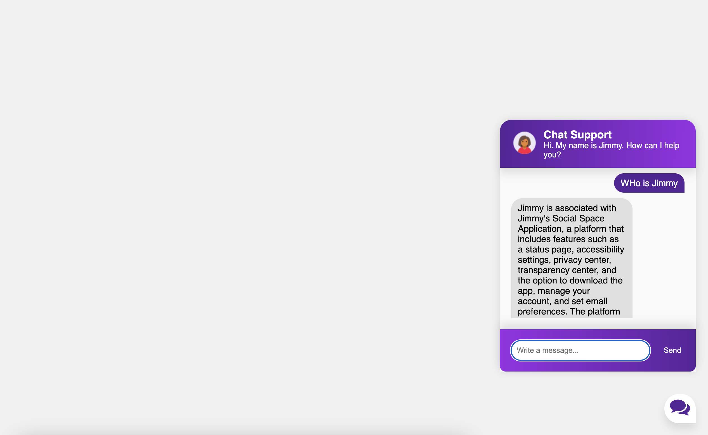

# RAG Bot Setup Guide 🤖

Welcome to the setup guide for the RAG Bot! This guide will help you install the necessary tools and run the bot on your system. Please follow the instructions step by step.

## Prerequisites
------------
Before you begin, make sure you have Python installed on your system. If you don’t have Python installed, you can download and install it from the official website: https://www.python.org/

Once Python is installed, proceed with the following steps:

## Step 1: Install Python
------------------------
If you haven’t already installed Python, follow these steps:

1. Go to https://www.python.org/downloads/.
2. Download the latest version of Python for your operating system (Windows/macOS/Linux).
3. Run the installer and ensure you check the box that says Add Python to PATH before clicking Install Now.

## Step 2: Locate the Directory
-----------------------------
1. Open File Explorer (Windows) or Finder (macOS).
2. Navigate to the folder where you want to set up the RAG Bot.
    - You can create a new folder by right-clicking in the desired location and selecting New Folder.

## Step 3: Open Command Prompt
----------------------------
For Windows:
1. Press Windows + R on your keyboard to open the "Run" dialog.
2. Type cmd and press Enter to open the Command Prompt.

For macOS:
1. Press Command + Space, then type Terminal and press Enter to open the Terminal.

## Step 4: Create a Virtual Environment
-------------------------------------
In the command prompt/terminal, type the following command and press Enter:

    python -m venv .venv

This will create a virtual environment called .venv in your current directory. The virtual environment ensures that your bot runs with the correct versions of dependencies.

## Step 5: Activate the Virtual Environment
-----------------------------------------
After creating the virtual environment, you need to activate it.

For Windows:
1. In the command prompt, type the following and press Enter:
    .\.venv\Scripts\activate

For macOS/Linux:
1. In the terminal, type the following and press Enter:
    source .venv/bin/activate

Once activated, your command prompt will show the environment name in parentheses, like this:

    (.venv) C:\Users\YourName\YourFolder>

## Step 6: Install Dependencies
----------------------------
Now that the virtual environment is activated, you need to install the required dependencies for the bot to work. Run the following command in the command prompt/terminal:

    pip install -r requirements.txt

This will install all the necessary Python packages that the RAG bot needs.

## Step 7: Run the Bot
-------------------
Once the dependencies are installed, you can start the bot by running the following command:

    python app.py

This will launch the RAG Bot, and it will begin functioning based on your configuration.

## UI Screenshot 

## Troubleshooting
---------------
- If you receive an error during the setup: Double-check that Python is installed and added to your system’s PATH. Revisit the installation steps.
- If you have trouble activating the virtual environment: Ensure you are in the correct folder and that the virtual environment was created successfully.

## Conclusion
----------
You have successfully set up and started the RAG Bot! If you need any further assistance, feel free to reach out for help.

Happy bot running! 🎉